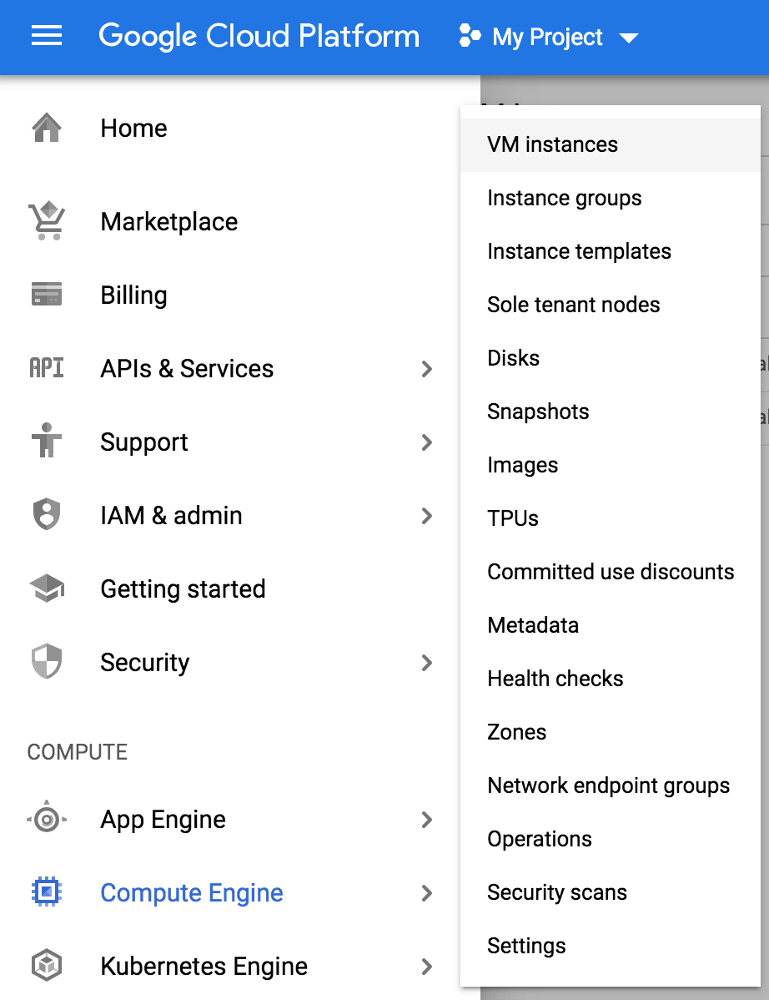
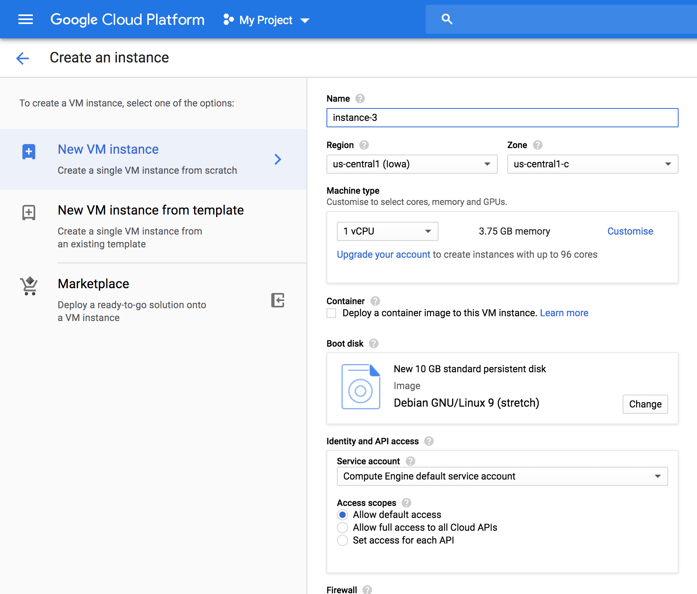
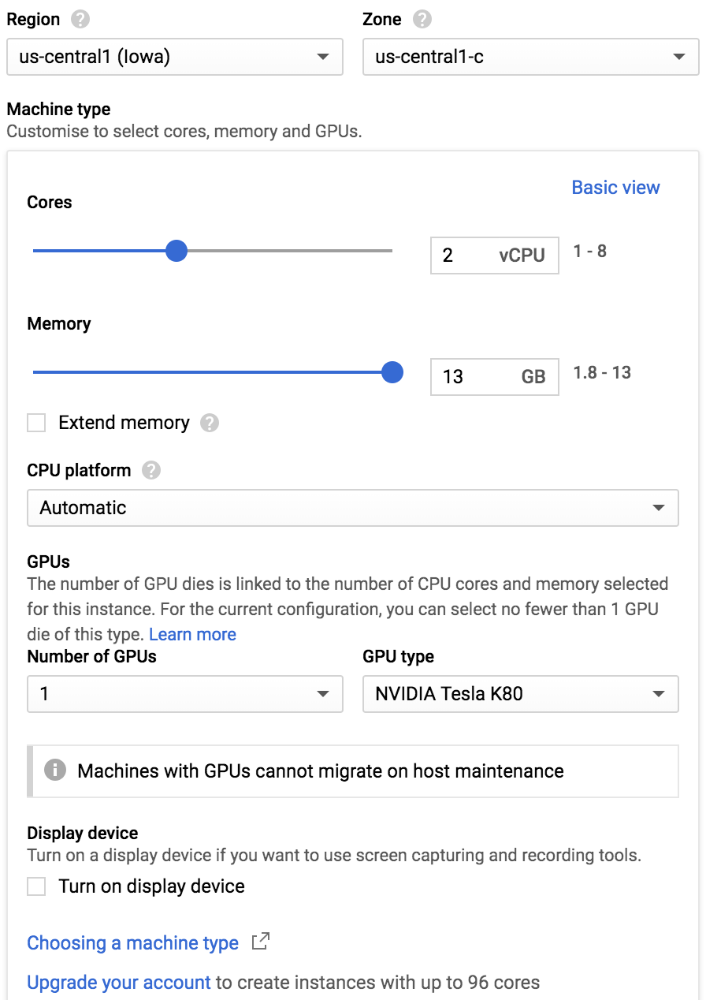
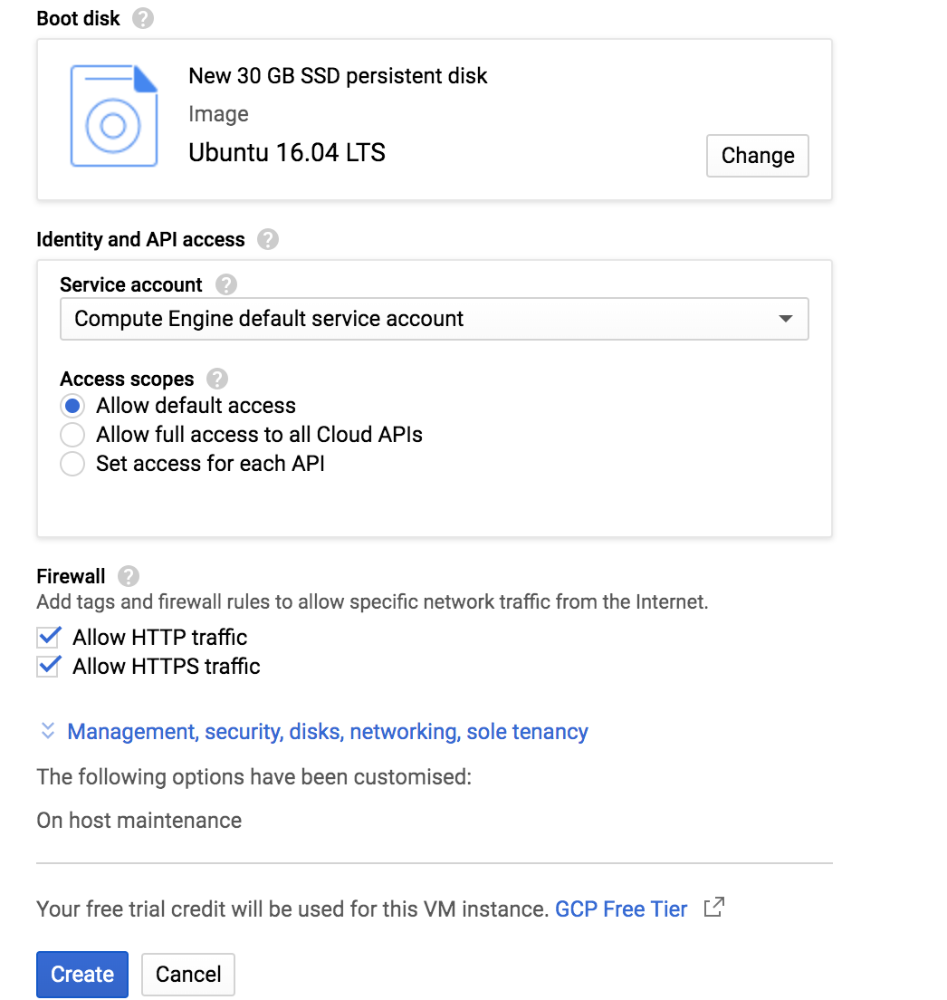
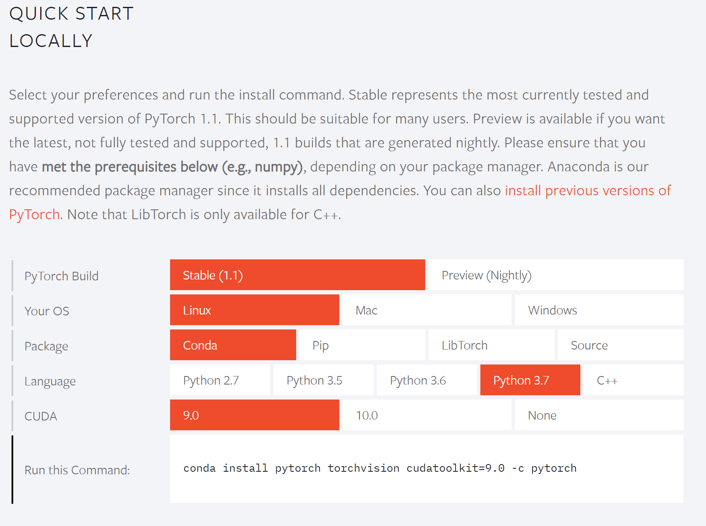

# Set up tensorflow with GPU on Google Cloud Platform
First of all, you should have a google account and sign up Google Cloud Platform (GCP). Note that if you do not need to train your model for some time. You can stop your instance to pause the charging. You can alway start the instance as needed, and everything in the instance will not change.

# Create compute engine instance on GCP
First, you shall create a compute engin in the GCP. Click 'Compute Engine' in the menu, then click on 'VM instances'.
<p align="center">
  
</p>

Next, you can click ‘Create new instance’ to create new instance. Here, you can name your instance, select server zones and customize your VM. Normally, I select my VM in ‘ us-central1 (lowa)’ (for the purpose of using Nvidia Tesla K80, not all zones have this GPU). 
<p align="center">
  
</p>

Next, click 'Customise' in the 'Machine type' tab to config your VM. I usually select 2 core CPU, 13 GB memory and 1 NVIDIA Tesla K80.
<p align="center">
  
</p>
As for the boot disk, you can select ‘Ubuntu 16.04 LTS’ here with at least 30 GB hard drive (a 100 GB SSD boot disk is recommended, and it will not result in much extra cost). Plus, remenber to allow http/https traffic in the firewall tab.
<p align="center">
  
</p>

Last, click 'create' and you are good to go. You can then connect to your VM via SSH.

# Set up environment for tenserflow GPU in your VM
Now, after creating the cloud computing VM, you can install nesscary packages to run your program.

NOTE: if you are setting up the environment on your PC, make sure to upgrade dGPU drivers in ''System Settings-->Software & Updates--> Additional Drivers'' by selecting 'Using NVIDIA binary driver-version xxx.xx form nvidia-xxx'.
## Install drivers
### Update linux packages
``` bash
sudo apt-get update
```
### Install dependencies
``` bash
sudo apt-get install openjdk-8-jdk git python-dev python3-dev python-numpy python3-numpy build-essential python-pip python3-pip python-virtualenv swig python-wheel libcurl3-dev curl
```
### Install Nvidia Drivers
You can searh the suitable driver on [https://developer.nvidia.com/cuda-80-ga2-download-archive]. You can download drivers that you found from the nvidia website (here we use the driver for ubuntu 16.04):
``` bash
curl -O http://developer.download.nvidia.com/compute/cuda/repos/ubuntu1604/x86_64/cuda-repo-ubuntu1604_9.0.176-1_amd64.deb
```

Then, you should download the key to allow installation:
``` bash
sudo apt-key adv --fetch-keys http://developer.download.nvidia.com/compute/cuda/repos/ubuntu1604/x86_64/7fa2af80.pub
```

Install downloaded packages:
```bash
sudo dpkg -i ./cuda-repo-ubuntu1604_9.0.176-1_amd64.deb
```

Next, you can install CUDA after finishing the installation of Nvidia driver:
``` bash
sudo apt-get update 
sudo apt-get install cuda-9-0
```

Last, you can check if Nvidia driver is correctly installed. Type 'nvidia-smi' in terminal, and you shall see something similar (remember to reboot is the command cannot be found):
```
yourUserName@instance-1:~$ nvidia-smi
Sun Jul 28 hh:mm:ss 2019  
+-----------------------------------------------------------------------------+
| NVIDIA-SMI 418.67       Driver Version: 418.67       CUDA Version: 10.1     |
|-------------------------------+----------------------+----------------------+
| GPU  Name        Persistence-M| Bus-Id        Disp.A | Volatile Uncorr. ECC |
| Fan  Temp  Perf  Pwr:Usage/Cap|         Memory-Usage | GPU-Util  Compute M. |
|===============================+======================+======================|
|   0  Tesla K80           Off  | 00000000:00:04.0 Off |                    0 |
| N/A   54C    P0    84W / 149W |      0MiB / 11441MiB |    100%      Default |
+-------------------------------+----------------------+----------------------+
                                                                               
+-----------------------------------------------------------------------------+
| Processes:                                                       GPU Memory |
|  GPU       PID   Type   Process name                             Usage      |
|=============================================================================|
|  No running processes found                                                 |
+-----------------------------------------------------------------------------+
```

Or, if you have muliple GPUs, you will see somthing like following:
```
yourUserName@instance-1:~$ nvidia-smi
Tue Aug 13 hh:mm:ss 2019       
+-----------------------------------------------------------------------------+
| NVIDIA-SMI 418.67       Driver Version: 418.67       CUDA Version: 10.1     |
|-------------------------------+----------------------+----------------------+
| GPU  Name        Persistence-M| Bus-Id        Disp.A | Volatile Uncorr. ECC |
| Fan  Temp  Perf  Pwr:Usage/Cap|         Memory-Usage | GPU-Util  Compute M. |
|===============================+======================+======================|
|   0  Tesla P4            Off  | 00000000:00:04.0 Off |                    0 |
| N/A   38C    P0    23W /  75W |      0MiB /  7611MiB |      0%      Default |
+-------------------------------+----------------------+----------------------+
|   1  Tesla P4            Off  | 00000000:00:05.0 Off |                    0 |
| N/A   36C    P0    23W /  75W |      0MiB /  7611MiB |      0%      Default |
+-------------------------------+----------------------+----------------------+
                                                                               
+-----------------------------------------------------------------------------+
| Processes:                                                       GPU Memory |
|  GPU       PID   Type   Process name                             Usage      |
|=============================================================================|
|  No running processes found                                                 |
+-----------------------------------------------------------------------------+
```


### Install cudnn
```
wget https://s3.amazonaws.com/open-source-william-falcon/cudnn-9.0-linux-x64-v7.3.1.20.tgz
sudo tar -xzvf cudnn-9.0-linux-x64-v7.3.1.20.tgz
sudo cp cuda/include/cudnn.h /usr/local/cuda/include
sudo cp cuda/lib64/libcudnn* /usr/local/cuda/lib64
sudo chmod a+r /usr/local/cuda/include/cudnn.h /usr/local/cuda/lib64/libcudnn*
```
Then, add paths to lib:
```
export LD_LIBRARY_PATH="$LD_LIBRARY_PATH:/usr/local/cuda/lib64:/usr/local/cuda/extras/CUPTI/lib64"
export CUDA_HOME=/usr/local/cuda
export PATH="$PATH:/usr/local/cuda/bin"
source ~/.bashrc
```

### Install Anaconda
Anaconda provides an easy installation of tensorflow. The download link of following code can be found in the anaconda download page, by right click the downloadable images.
```
wget https://repo.continuum.io/archive/Anaconda3-2018.12-Linux-x86_64.sh 
bash Anaconda3-2018.12-Linux-x86_64.sh
```
Add conda to path:
```
export PATH=~/anaconda3/bin:$PATH
```

### Install tensorflow GPU version via Anaconda
Note that 'tfgpu' in the following code is the name of environment, you can change it to anything as you like.
```
conda create -n tfgpu tensorflow-gpu
conda activate tfgpu
```

#### Tips for use
Every time you connect to the VM, you shall run the tfgpu virtual envirment to use the tensorflow:
```
conda activate tfgpu
```

### Install PyTorch
You can find the code for installation on [https://pytorch.org/]. We select 'Linux', 'Conda', 'Python 3.7', ''CUDA 9.0 here. 
<p align="center">
  
</p>

Then you can run the following code to install PyTorch in your terminal (You may also install it in conda virtual environment if you like).
```
conda install pytorch torchvision cudatoolkit=9.0 -c pytorch
```

## (Optional) other interesting packages that may help you
### htop
You can install htop to track your VM usage, it is more readable than 'top':
```
sudo apt-get install htop
```
To run htop, type htop' in your ssh terminal.

### scikit-learn
Install within conda virtual environment:
```
conda install scikit-learn
```
### progress
It should be a built-in function in your Python. Nevertheless, sometimes you may not be able to import it. Install within conda virtual environment:
```
conda install -c conda-forge progress
```

### python-mnist
```python-mnist``` is an usefull tool to read the MNIST dataset. It can be installed by:
```
pip install python-mnist
```
The sample code for using this package can be find at [https://github.com/sorki/python-mnist]

Sometimes you may not be able to import mnist package after the installation. This due to the conflict between ```python-mnist``` and ```mnist```. You can simply uninstall the ```mnist``` package to solve the problem. 
[ref: https://stackoverflow.com/a/46781599]
